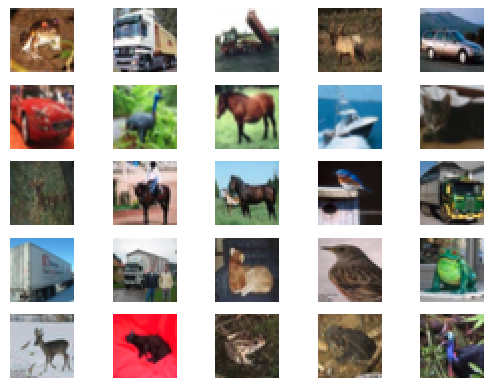
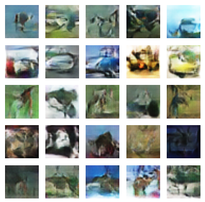

# Training Conditional GAN on CIFAR-10 Dataset

In this project, I trained a Conditional GAN (CGAN) on the CIFAR-10 dataset. The CIFAR-10 dataset contains 10 classes, each with approximately 6,000 images. Each image is 32x32 pixels with 3 color channels (RGB). Although the images are relatively small, training a CGAN on these images was straightforward.

The CIFAR-10 dataset includes the following classes:

- Airplane
- Automobile
- Bird
- Cat
- Deer
- Dog
- Frog
- Horse
- Ship
- Truck

After training 100 epochs, CGAN started to make reasonable images. For better results, train the model on 500 epochs.

The following video shows how CGAN improved after every epoch:

